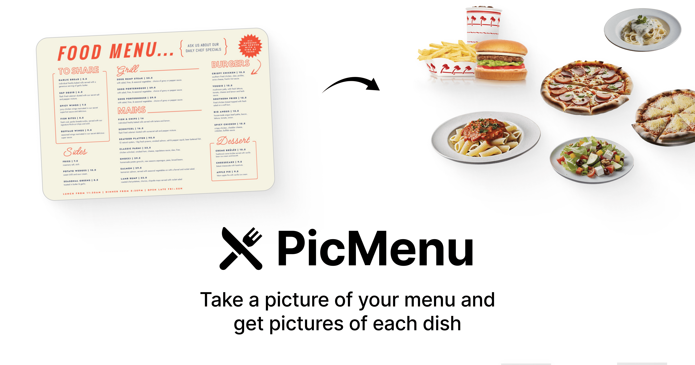

<a href="https://www.picmenu.co">
  
  <h1 align="center">PicMenu</h1>
</a>

  Take a picture of your restaurant menu and generate nice images for each dish.

## Tech stack

- [Llama 3.2 Vision 90B](https://togetherai.link/) on Together AI to extract menu items from an image
- [Llama 3.1 8B](https://togetherai.link/) on Together AI for structured outputs (JSON mode)
- [Flux Schnell](https://togetherai.link/) on Together AI for image generation
- [Next.js](https://nextjs.org/) with TypeScript for the app framework
- [Shadcn](https://ui.shadcn.com/) for UI components & [Tailwind](https://tailwindcss.com/) for styling
- [Plausible](https://plausible.io/) & [Helicone](https://helicone.ai/) for analytics & observability

## Cloning & running

1. Clone the repo: `git clone https://github.com/Nutlope/picmenu`
2. Create a `.env` file and add your [Together AI API key](https://api.together.xyz/settings/api-keys): `TOGETHER_API_KEY=`
3. Create an S3 bucket and add the credentials to your `.env` file. Follow [this guide](https://next-s3-upload.codingvalue.com/setup) to set them up. All required values are in the `.env.example` file.
4. Run `npm install` and `npm run dev` to install dependencies and run locally.

## Future Tasks

- [ ] Generate additional details (ingredients, origin, calories, taste) then display them in a modal when a user clicks a menu item
- [ ] After upload, do a nice scroll to the loading state when it's loading
- [ ] Better account for errors if it crashes (or if menu is too big). Also warn users it can take up to 60 seconds
- [ ] Make the "use our example" link show a lot of custom menus in different languages, maybe in a modal
- [ ] Iterate on the image prompt to make the images more realistic
- [ ] Try out using Flux Dev instead of Flux Schnell
- [ ] Add some tags as well (like spicy, vegetarian, vegan, etc.) to make the UI better
- [ ] Add filters for those tags to be able to filter by them for food restrictions
